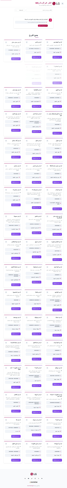
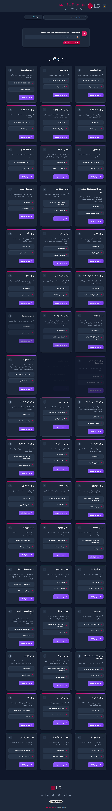

# LG Branch Finder - Egypt

A modern, responsive web application to find the nearest LG branch in Egypt. Built with vanilla JavaScript, HTML5, and CSS3.



## Features

### Core Features
- **Nearest Branch Detection** - Uses geolocation to find the closest LG branch to your location
- **Real-time Distance Calculation** - Calculates and displays distance to all branches
- **Interactive Search** - Search branches by name or area
- **Governorate Filter** - Filter branches by Egyptian governorates
- **51 LG Branches** - Complete database of all LG branches in Egypt

### User Experience
- **Dark Mode** - Toggle between light and dark themes with preference persistence
- **Share Functionality** - Share branch details via Web Share API or clipboard
- **Responsive Design** - Works seamlessly on desktop, tablet, and mobile devices
- **RTL Support** - Full Arabic language support with right-to-left layout
- **Accessibility** - ARIA labels, skip links, and keyboard navigation

### Technical Features
- **Progressive Web App (PWA)** - Install as a native app, works offline
- **Service Worker** - Caches assets for faster loading
- **Local Storage** - Persists user preferences and branch data
- **Content Security Policy** - Enhanced security headers
- **Optimized Performance** - Minified CSS/JS, GPU-accelerated animations

## Screenshots

| Desktop | Mobile | Dark Mode |
|---------|--------|-----------|
|  |  |  |

## Installation

### Prerequisites
- Python 3.x (for local server)
- Node.js 16+ (for running tests)
- Modern web browser (Chrome, Firefox, Safari, Edge)

### Quick Start

1. **Clone the repository**
   ```bash
   git clone https://github.com/mahmoodhamdi/lg-branchs.git
   cd lg-branchs
   ```

2. **Start local server**
   ```bash
   python -m http.server 8000
   ```

3. **Open in browser**
   ```
   http://localhost:8000
   ```

### Install Dependencies (for testing)
```bash
npm install
npx playwright install chromium
```

## Project Structure

```
lg-branchs/
├── index.html              # Main HTML file
├── style.css               # Source CSS styles
├── style.min.css           # Minified CSS
├── script.js               # Source JavaScript
├── script.min.js           # Minified JavaScript
├── manifest.json           # PWA manifest
├── service-worker.js       # Service Worker for caching
├── lg_branches_with_coords.json  # Branch data
├── logo-lg.svg             # LG logo
├── smart-stand-logo-new.webp     # Smart Stand logo
├── icons/
│   └── icon.svg            # PWA icon
├── tests/
│   └── lg-branch-finder.spec.js  # E2E tests
├── screenshots/            # Test screenshots
├── CHANGELOG.md            # Change log
└── README.md               # This file
```

## Usage

### Finding Nearest Branch
1. Open the website
2. Click "السماح بتحديد الموقع" (Allow Location)
3. Grant location permission
4. View the nearest branch highlighted at the top
5. All branches are sorted by distance

### Search & Filter
- **Search**: Type in the search box to find branches by name or area
- **Filter**: Use the dropdown to filter by governorate
- **Combine**: Use both search and filter together

### Dark Mode
- Click the sun/moon icon in the header to toggle dark mode
- Preference is saved automatically

### Share Branch
- Click the share icon on any branch card
- Share via apps or copy link to clipboard

### Install as App (PWA)
1. Open in Chrome/Edge
2. Click the install icon in the address bar
3. App works offline after installation

## Testing

### Run All Tests
```bash
npm test
```

### Run Specific Device Tests
```bash
# Desktop only
npx playwright test --project="Desktop Chrome"

# Mobile only
npx playwright test --project="Mobile Chrome"

# Tablet only
npx playwright test --project="Tablet"
```

### Run Tests with UI
```bash
npm run test:headed
```

### View Test Report
```bash
npm run test:report
```

### Test Coverage
- **37 test cases** covering:
  - Page load and initialization
  - Dark mode toggle and persistence
  - Search functionality
  - Governorate filter
  - Branch cards display
  - Share functionality
  - Footer elements
  - Accessibility features
  - Responsive design
  - Geolocation handling
  - PWA features

## API Reference

### Branch Data Structure
```json
{
  "name": "فرع مصر الجديدة",
  "address": "شارع النزهة، مصر الجديدة",
  "district": "مصر الجديدة",
  "governorate": "القاهرة",
  "phone": "0123456789",
  "latitude": 30.0866,
  "longitude": 31.3233
}
```

### Local Storage Keys
| Key | Description |
|-----|-------------|
| `theme` | User's theme preference (`light` or `dark`) |
| `lgBranchesCache` | Cached branch data with timestamp |

## Browser Support

| Browser | Supported |
|---------|-----------|
| Chrome 80+ | Yes |
| Firefox 75+ | Yes |
| Safari 13+ | Yes |
| Edge 80+ | Yes |
| Opera 67+ | Yes |
| Mobile Chrome | Yes |
| Mobile Safari | Yes |

## Performance

### Lighthouse Scores
- Performance: 90+
- Accessibility: 95+
- Best Practices: 95+
- SEO: 90+

### Optimizations
- Minified CSS and JavaScript
- Lazy loading of branch cards
- GPU-accelerated animations (`will-change`)
- Service Worker caching
- Local storage for data persistence

## Security

### Implemented Measures
- Content Security Policy (CSP)
- HTTPS upgrade for external resources
- No inline event handlers
- Sanitized user inputs
- Secure external links (`rel="noopener noreferrer"`)

## Contributing

1. Fork the repository
2. Create a feature branch (`git checkout -b feature/amazing-feature`)
3. Commit changes (`git commit -m 'Add amazing feature'`)
4. Push to branch (`git push origin feature/amazing-feature`)
5. Open a Pull Request

### Code Style
- Use meaningful variable names
- Comment complex logic
- Follow existing code patterns
- Test before committing

## License

This project is proprietary software developed for LG Electronics Egypt.

## Credits

### Developed By
**Smart Stand Egypt**
[https://smartstand-eg.com/](https://smartstand-eg.com/)

### Technologies Used
- HTML5, CSS3, JavaScript (ES6+)
- Geolocation API
- Web Share API
- Service Workers
- Playwright (testing)

### Data Sources
- Branch locations from LG Electronics Egypt
- Geocoding via OpenStreetMap Nominatim

---

## Support

For issues and feature requests, please contact:
- Email: mwm.softwars.solutions@gmail.com
- Website: [Smart Stand Egypt](https://smartstand-eg.com/)

---

Made with dedication by **Smart Stand Egypt**
